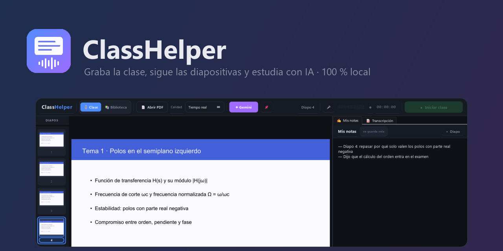
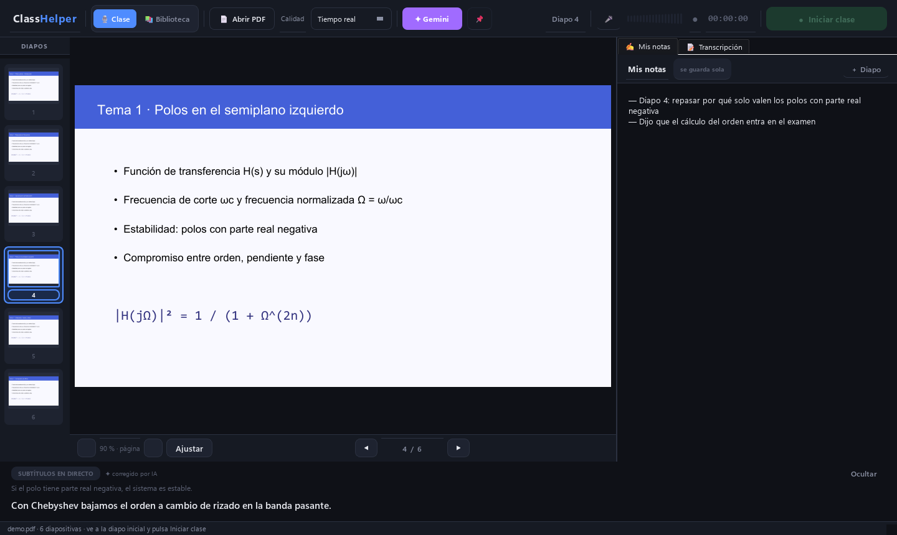
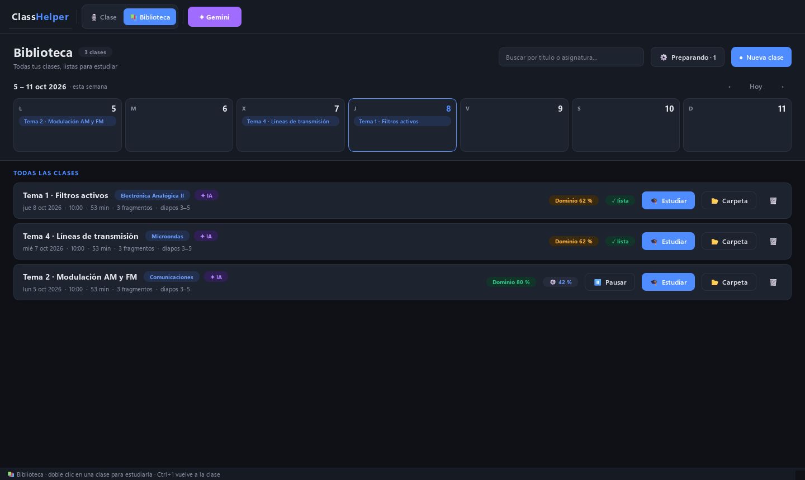
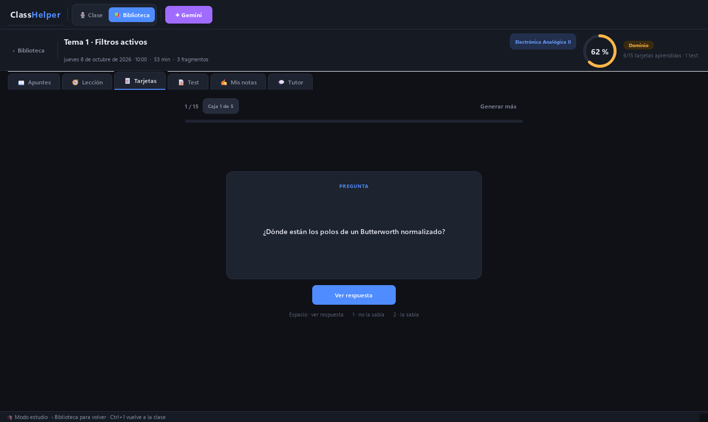

<p align="center">
  
</p>

<p align="center">
  <b>Graba la clase, sigue las diapositivas y estudia con IA.</b><br>
  App de escritorio para Windows hecha por y para estudiantes de ingeniería.<br>
  <sub>Desktop app that records lectures, links what the professor says to each slide, and turns it into study material.</sub>
</p>

<p align="center">
  
  
  
  
  
</p>

---

## Qué hace

| | |
|---|---|
| 🎙️ **Graba la clase** | Audio continuo guardado en tiempo real: aunque la app se cierre, no se pierde nada. |
| 📄 **Sigue las diapositivas** | Abres el PDF del tema y cada frase del profe queda ligada a la diapositiva que tenías delante. |
| 💬 **Subtítulos en directo** | Transcripción local con Whisper, solo orientativa, abajo como subtítulos. |
| ✍️ **Mis notas** | Apuntas dudas mientras el profe habla; la IA las tiene en cuenta después. |
| ✨ **Apuntes desde el audio** | Al terminar, el audio se vuelve a transcribir con un modelo grande (`large-v3-turbo`) mucho más preciso. |
| 📚 **Biblioteca que se prepara sola** | Resumen, 15 tarjetas de memoria y un test de 10 preguntas por clase, sin pulsar nada. |
| 🃏 **Modo estudio** | Tarjetas con repetición espaciada, test con lagunas de conocimiento, lección guiada y tutor que responde con lo que se dijo en clase. |

## Capturas

<p align="center"><br><sub>En clase: la diapositiva manda, subtítulos abajo y tus notas a la derecha.</sub></p>
<p align="center"><br><sub>Biblioteca con vista semanal: cada clase se prepara sola en segundo plano.</sub></p>
<p align="center"><br><sub>Modo estudio: tarjetas, test, lección guiada y tutor.</sub></p>

## Privacidad

- **El audio nunca sale de tu ordenador.** La transcripción (Whisper) es 100 % local.
- La IA (opcional) solo recibe **texto** para pulirlo, resumir y crear tarjetas. Gemini tiene plan gratuito; también funciona con Ollama en local, OpenAI o Claude.
- Tu clave de API vive en `config.json`, que **no se sube nunca** (está en `.gitignore`).

## Instalación

Necesitas Windows 10/11 y Python 3.11 o superior.

```bat
git clone https://github.com/<tu-usuario>/ClassHelper.git
cd ClassHelper
setup.bat          :: crea el entorno e instala dependencias
run.bat            :: abre la app
```

Para generar el ejecutable (`dist\ClassHelper\ClassHelper.exe` + acceso directo en el escritorio):

```bat
build.bat
```

La primera vez se descarga el modelo de Whisper (`small` ≈ 500 MB; `large-v3-turbo` ≈ 1,6 GB para los apuntes finales).

### IA (opcional)

Copia `config.example.json` a `config.json` o, más fácil, pulsa **✦ IA** dentro de la app y pega tu clave gratuita de [Google AI Studio](https://aistudio.google.com/app/apikey). Sin IA la app funciona igual, solo con Whisper.

## Cómo se usa

1. **Clase** → Abrir PDF → ve a la diapositiva inicial → **Iniciar clase** (`Ctrl+R`).
2. Cambia de diapositiva con ← → o las miniaturas. `Ctrl+M` marca un momento importante.
3. **Detener clase** → la clase se guarda en la **Biblioteca** y empieza a prepararse sola.
4. **Biblioteca → ⚙ Preparación** para preparar todo lo pendiente de una vez, elegir núcleos, o que solo trabaje con el cargador enchufado. Mientras prepara, el PC no se suspende.
5. **Estudiar** → tarjetas (Espacio, 1, 2), test, lección y tutor.

## Cómo está hecho

```
main.py              arranque, icono y --selftest
window.py            ventana: modos Clase / Biblioteca / Estudiar
audio_thread.py      micro (WASAPI 48 kHz → 16 kHz), troceado por silencios, Whisper en vivo
refine.py            repaso con large-v3-turbo del audio completo
auto_process.py      cola de preparación: turbo → resumen → tarjetas → test
ai_enhancer.py       proveedores de IA con cadena de modelos y reintentos
study_ai.py          tarjetas, test, lagunas, lección y tutor (JSON validado)
session_store.py     biblioteca en JSON (Documentos\ClassHelper) y repetición espaciada
pdf_panel.py · thumbnail_strip.py · notes_panel.py · subtitle_bar.py · live_notes.py
library_panel.py · study_panel.py · settings_dialog.py · theme.py · widgets.py
```

Decisiones medidas con clases reales (portátil i7 sin GPU):

- En directo se usa **Whisper small**, el único que va por delante del profe; los apuntes buenos se rehacen después con **turbo** (≈ 1,3× la duración del audio con 8 núcleos).
- El micro se abre por **WASAPI** a su frecuencia nativa: por la entrada clásica de Windows el filtro de ruido metía silencio digital y se comía sílabas del profe.
- Las respuestas de la IA se piden en **modo JSON** y se validan; si un modelo gratuito se queda sin cuota, se pasa solo al siguiente.

## Próximas ideas

- Apuntes en modo diálogo: **Profe** / **Compañero** (identificación de voces en local).
- Exportar a Anki y a PDF.
- Aceleración por GPU cuando la haya.

## Licencia

[MIT](LICENSE)
